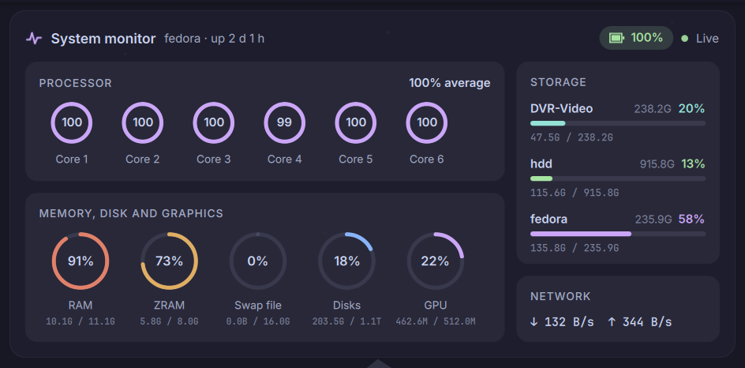
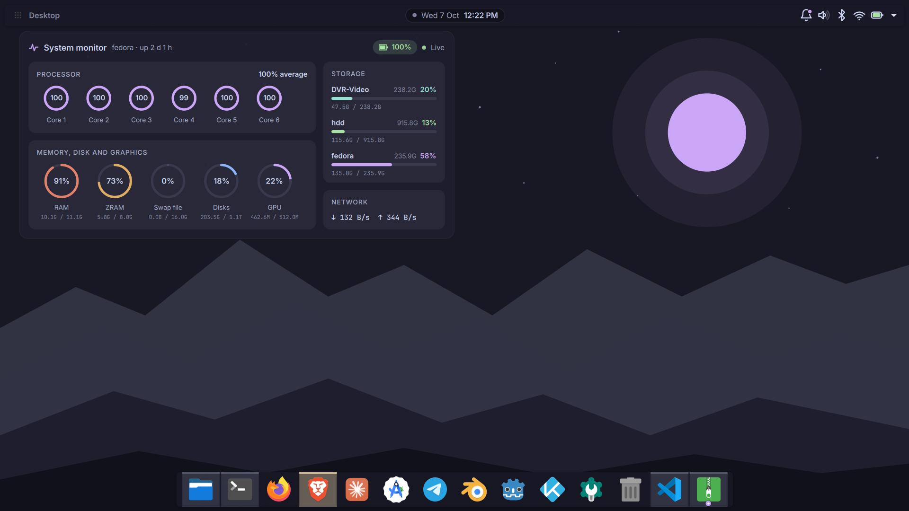

# Jarvis Monitor

A desktop system monitor widget for **KDE Plasma 6**, in Catppuccin Mocha colours.



## What it shows

| Section | Details |
|---|---|
| **Header** | Hostname, uptime, battery level (charging or not) and a Live dot |
| **Processor** | One ring per CPU core, plus the average across all cores |
| **Memory, disk and graphics** | RAM, ZRAM, swap file, internal disks and GPU, with used / total under each ring |
| **Storage** | One bar per mounted volume, found automatically: drives you plug in appear, drives you remove disappear |
| **Network** | Download and upload speed |

RAM, ZRAM, swap and disk rings change colour as they fill up: amber at 70%, red at 90%.
CPU and GPU never change colour, because running them at 100% is normal.



## Requirements

- KDE Plasma 6.0 or newer
- `ksystemstats` (Plasma's sensor service; installed with Plasma)
- `lsblk` (util-linux)

## Install

```bash
git clone git@github.com:K-S-Harish-Balagi/JARVIS_widget-v2.git
kpackagetool6 --type Plasma/Applet --install JARVIS_widget-v2/com.claude.jarvismonitor
```

Then right-click the desktop → **Add or Manage Widgets** → search for **Jarvis Monitor**.

To update after a `git pull`:

```bash
kpackagetool6 --type Plasma/Applet --upgrade com.claude.jarvismonitor
systemctl --user restart plasma-plasmashell.service
```

For development, link the folder instead of copying it, so edits take effect after a Plasma restart:

```bash
ln -s "$PWD/com.claude.jarvismonitor" ~/.local/share/plasma/plasmoids/com.claude.jarvismonitor
```

## Settings

Right-click the widget → **Configure Jarvis Monitor…**

| Setting | Default |
|---|---|
| Accent colour | `#cba6f7` (Mauve) |
| Holographic scan-line and grid effects | On |
| Number of CPU core rings | 6 |
| Show battery, GPU, network | On |
| Hide volumes smaller than | 10 GiB |

## Where the numbers come from

- **CPU, RAM, GPU, network, battery:** Plasma's own sensors (`ksystemstats`).
- **ZRAM and swap file:** read separately from `/proc/swaps`, because Plasma only reports them as one combined total.
- **Disk ring:** counts internal drives only, so a plugged-in USB stick doesn't push it up.
- **Storage bars:** found at run time and checked against `lsblk`, so a drive that was pulled out without ejecting disappears too.
- **Uptime:** `/proc/uptime`.

## Files

```
com.claude.jarvismonitor/
├── metadata.json              widget id, name, version
└── contents/
    ├── config/                settings schema and settings page
    └── ui/
        ├── main.qml           layout, sensors, probes
        ├── ArcGauge.qml       ring gauge
        ├── DiskBar.qml        storage bar
        └── BatteryIndicator.qml
```
